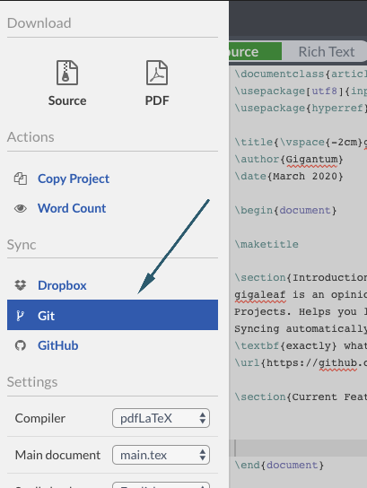

# gigaleaf
[](https://circleci.com/gh/gigantum/gigaleaf/tree/master)

An opinionated library to link Gigantum Projects to Overleaf Projects. This tool automatically manages git repositories
to link the outputs from a Gigantum Project to an Overleaf Project, letting you build a completely reproducible 
workflow from analysis to publication.

**NOTE: This library is an early alpha proof of concept and subject to change!**

**NOTE: This library uses the Overleaf git bridge and is only included in paid Overleaf accounts. The Overleaf project
owner must have a paid account, but collaborators do not.**

### Installation
gigaleaf may be installed using pip.

```bash
pip install gigaleaf
```

### Usage

gigaleaf is currently designed to work inside Jupyter Notebooks running in Gigantum. The high-level API is pretty simple. The general workflow is:

* Create an Overleaf Project
  
* Get the git share URL from Overleaf
  * Click on "Git" under the sync options
    
    
    
  * Copy the URL only (not the entire git command) from the modal that is shown
    
    

* Create an instance of gigaleaf

  ```python
  from gigaleaf import Gigaleaf
  
  gl = Gigaleaf()
  ```
  
  This will start the configuration process where you enter the Overleaf URL along with
  the email and password you use to log into Overleaf. These will be stored in a file locally that is "untracked" in 
  Gigantum and therefore will not sync or be shared. Other users will be prompted for _their_ Overleaf credentials if
  they run your notebook. To be able to access your Overleaf project and run `gigaleaf` commands, they must also have 
  access to your Overleaf project. 
  
* Link an output file

  ```python
  gl.link_image('../output/fig1.png')
  ```
  
  Here, you pass the relative path in Gigantum to the that file you want to link. Currently image and csv files are
  supported. Any time this file changes and you sync, it will automatically be updated in your Overleaf project! 
  **You only need to call this once per file that you wish to track. Calling it again will update settings (e.g.
  a figure caption)**
  
* Sync Projects

  ```python
  gl.sync()
  ```
  
  This will pull changes from Overleaf, apply all gigaleaf managed changes, and then push back to Overleaf. Once files
  are linked, you typically will only be calling `.sync()`. It's safe to call `.sync()` multiple times, in particular
  at the end of a notebook when you'd want to update Overleaf with your latest results.

### Advanced Usage

gigaleaf also provides Latex subfiles that you can use into your Overleaf Project that make adding and updating content
from Gigantum trivial. To take full advantage of this, the link methods have optional arguments:

`.link_image()` 

* caption: A caption that will be added to the image. If omitted, not caption is inserted.
* label: A label to add to the figure for referencing inside your Overleaf document.
* width: A string to set width of the image. The default is "0.5\\textwidth".
* alignment: A string to set the position of the image using the `adjustbox` package. The default is 'center'.

`.link_csv()` 

* caption: A caption that will be added to the table. If omitted, not caption is inserted.
* label: A label to add to the table for referencing inside your Overleaf document.

To use the subfiles generated you need to make a few modifications to your `main.tex` preamble. You may need to modify
this depending on your exact project configuration:

```latex
% gigaleaf setup
\usepackage[export]{adjustbox} % Needed if linking image files
\usepackage{graphicx} % Needed if linking image files
\graphicspath{{gigantum/data/}{../data/}} % Needed if linking image files
\usepackage{csvsimple} % Needed if linking csv files
\usepackage{float} % Needed if linking csv files
\restylefloat{table} % Needed if linking csv files
\usepackage{subfiles} % Best loaded last in the preamble
% gigaleaf setup
```

Once configured, you can simply import the subfiles as they are created in your project. They will be named in a way
that matches the files they are linked to:

```latex
\subfile{gigantum/subfiles/fig1_png}
```

In this example, this subfile would render the image `fig1.png` that we linked above.


### Contributing

This project is packaged using [poetry](https://python-poetry.org/). To develop, install packages with:

```bash
poetry install
```

When working, be sure to sign-off all of your commits.

If trying to install in a Gigantum Project from source for testing, poetry needs to not try to create a virtualenv
and should install as the user. This can be done by setting the following options:

```bash
poetry config virtualenvs.create false
export PIP_USER=yes
```


### Acknowledgements

Thanks to Simon Porter ([@sjcporter](https://gigantum.com/sjcporter)) for valuable conversations and creating an
early version of this concept in his ["What does a university look like" project](https://gigantum.com/sjcporter/what-does-a-university-look-like). 


